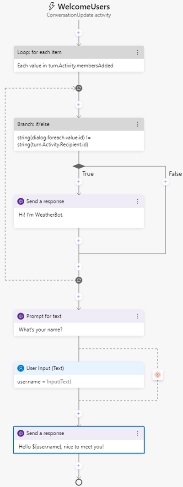
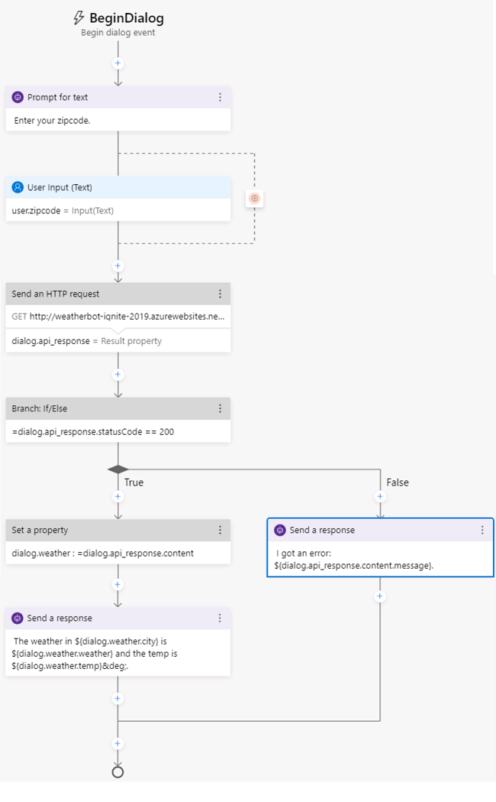
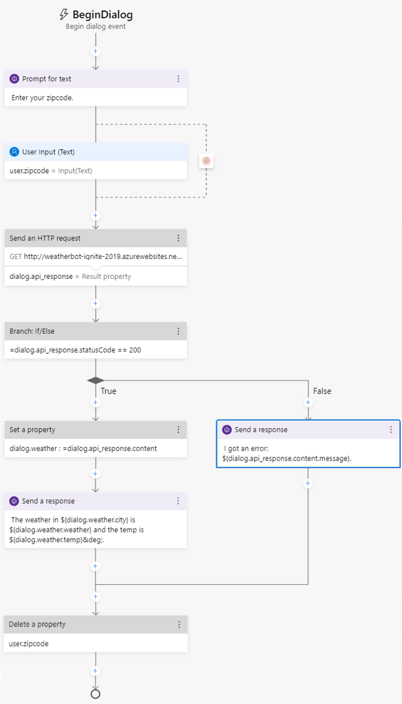
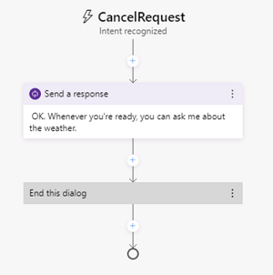

---
lab:
    title: 'Bot Framework Composer를 사용하여 봇 만들기'
    module: '모듈 7 - 대화형 AI 및 Azure Bot Service'
---

# Bot Framework Composer를 사용하여 봇 만들기

코드를 작성하지 않고도 정교한 대화형 봇을 빠르고 쉽게 빌드할 수 있는 그래픽 디자이너인 Bot Framework Composer는 봇 빌드용 시각적 캔버스를 제공하는 오픈 소스 도구입니다.

## OpenWeather API 키 가져오기

이 연습에서는 사용자가 입력한 우편 번호에 해당하는 지역의 기상 상황을 검색하는 봇을 만듭니다. 서비스가 작동하려면 API 키가 필요합니다.

1. 웹 브라우저에서 OpenWeather 사이트 `https://openweathermap.org/price`로 이동합니다.
2. 무료 API 키를 요청하고 OpenWeather 계정을 만듭니다(계정이 아직 없는 경우).
3. 등록 후 **API keys** 페이지를 표시하여 API 키를 확인합니다.

## 봇 만들기

이제 Composer를 사용하여 봇을 만들 수 있습니다.

### 봇을 만들고 "환영" 대화 흐름 사용자 지정

1. Bot Framework Composer를 시작합니다.

    **참고**: Bot Framework Composer는 정기적으로 업데이트됩니다. 업데이트를 설치하라는 메시지가 표시되면 현재 로그인되어 있는 사용자용으로 업데이트를 설치합니다. 업데이트에는 이 연습의 지침에 영향을 주는 사용자 인터페이스 변경 내용이 포함되어 있을 수 있습니다.

2. **홈** 화면에서 **새로 만들기**를 선택합니다. 그런 다음 새 봇을 처음부터 만들고 이름을 **WeatherBot**으로 지정하여 로컬 폴더에 저장합니다.
3. 왼쪽 탐색 창에서 **인사말**을 선택하여 제작 캔버스를 열고 *ConversationUpdate* 활동을 표시합니다. 사용자가 봇과의 대화에 처음 참가하면 호출되는 이 활동은 여러 작업의 흐름으로 구성되어 있습니다.
4. 오른쪽의 속성 창에서 **인사말** 제목을 편집합니다. 이렇게 하려면 오른쪽 속성 창 위쪽의 **Greeting**이라는 단어를 선택하여 **WelcomeUsers**로 변경합니다.
5. 제작 캔버스에서 **응답 보내기** 작업을 선택합니다. 그런 다음 속성 창에서 **언어 생성** 상자의 기본 텍스트를 *- ${WelcomeUser()}* 에서 `- Hi! I'm WeatherBot.`으로 변경합니다("-" 대시 포함).
6. 제작 캔버스에서 마지막 **+** 기호(대화 흐름 <u>끝</u>을 표시하는 원 바로 위에 있음)를 선택하고 **텍스트** 응답에 대해 새 **질문하기** 작업을 추가합니다.

    새 작업은 대화 흐름에 노드 2개를 만듭니다. 첫 번째 노드는 사용자에게 질문을 하는 봇의 프롬프트를 정의하며, 두 번째 노드는 사용자로부터 수신되는 응답을 나타냅니다. 속성 창에는 이러한 각 노드에 해당하는 **봇 질문** 및 **사용자 입력** 탭이 있습니다.

7. 속성 창의 **봇 질문** 탭에서 **텍스트에 대한 프롬프트** 값을 `- What's your name?`으로 설정합니다. 그런 다음 **사용자 입력** 탭에서 **속성** 값을 `user.name`으로 설정하여 나중에 봇 대화에서 액세스할 수 있는 변수를 정의합니다.
8. 제작 캔버스로 돌아와서 방금 추가한 **사용자 입력(텍스트)** 작업 아래에서 **+** 기호를 선택하고 **응답 보내기** 작업을 추가합니다.
9. 새로 추가한 **응답 보내기** 작업을 선택하고 속성 창에서 **언어 생성** 값을 `- Hello ${user.name}, nice to meet you!`로 설정합니다.

    완성된 활동 흐름은 다음과 같습니다.

    

### 봇 테스트

기본 봇이 완성되었으므로 이제 봇을 테스트해 보겠습니다.

1. Composer 오른쪽 위에서 **봇 시작**을 선택하고 봇이 컴파일 및 시작되는 동안 기다립니다. 이 경우 몇 분 정도 걸릴 수 있습니다.

    - Windows 방화벽 메시지가 표시되면 모든 네트워크에 액세스할 수 있도록 설정합니다.

2. **로컬 봇 런타임 관리자** 창에서 **Emulator에서 테스트**를 선택합니다. 그런 다음 Bot Framework Emulator가 시작될 때까지 기다립니다.
3. Bot Framework Emulator가 시작되고 잠시 후에 환영 메시지와 이름을 입력하라는 메시지가 표시됩니다.  이름을 입력하고 **Enter** 키를 누릅니다.
4. 봇에 **Hello *your_name*, nice to meet you!** 라는 응답이 표시됩니다.
5. Emulator를 닫습니다.
6. Composer의 **로컬 봇 런타임 관리자** 창에서 ⏹ 아이콘을 사용하여 봇을 중지합니다.

## 날씨를 가져오는 대화 상자 추가

이제 정상 작동하는 봇이 완성되었으므로 특정 상호 작용을 위한 대화 상자를 추가하여 봇의 기능을 확장할 수 있습니다. 여기서는 사용자가 "weather"를 언급하면 트리거되는 대화 상자를 추가합니다.

### 대화 상자 추가

먼저 날씨 관련 질문을 처리하는 데 사용할 대화 흐름을 정의해야 합니다.

1. Composer의 탐색 창에서 최상위 노드(**WeatherBot**) 위에 마우스를 놓고 **&#8285;** 메뉴에서 그림과 같이 **+ 대화 추가**를 선택합니다.

    

    그런 다음 설명을 **제공된 우편 번호에 해당하는 지역의 현재 기상 상황 가져오기**로 지정하여 새 대화 **getWeather**를 작성합니다.
2. 탐색 창에서 새 **getWeather** 대화의 **BeginDialog** 노드를 선택합니다. 그런 다음 제작 캔버스에서 **+** 기호를 사용하여 **텍스트** 응답에 대해 **질문하기** 작업을 추가합니다.
3. 속성 창의 **봇 질문** 탭에서 **텍스트에 대한 프롬프트** 값을 `- Enter your zipcode.`로 설정합니다.
4. **사용자 입력** 탭에서 **속성** 필드를 `user.zipcode`로 설정하고, 사용자가 제공한 값 앞뒤의 불필요한 공백이 제거되도록 **출력 형식** 필드를 `=trim(this.value)` 식으로 설정합니다.
5. **기타** 탭에서 다음 값을 설정하여 우편 번호 입력의 유효성 검사 규칙을 정의합니다.
    - **인식자** 영역에서 **인식할 수 없는 프롬프트** 필드를 `- Sorry the value '${this.value}' doesn't appear to be a valid entry.  Please enter a zip code in the form of 12345.`로 설정합니다.
    - **유효성 검사** 섹션에서 유효성 검사 규칙 `length(this.value) == 5`를 추가합니다. 이 규칙은 우편 번호 항목에 문자가 5개만 포함되어 있는지를 확인합니다. 그런 다음 **잘못된 프롬프트** 필드를 `- Sorry, '${this.value}' is not valid. I'm looking for a 5-digit number as zip code. Please specify a zip code in the form 12345.`로 설정합니다.
    - **프롬프트 구성** 섹션에서 **기본값** 속성을 `98052`로 설정합니다.

        기본적으로 프롬프트는 사용자에게 *최대 턴 카운트* 횟수(기본값: 3)를 묻도록 구성됩니다. 최대 턴 카운트에 도달하면 프롬프트는 중지되고 속성이 **기본값** 필드에 정의된 값으로 설정된 후 대화가 계속 진행됩니다.

    지금까지 작성한 활동 흐름은 다음과 같습니다.

    

    지금까지 작성한 대화에서는 사용자에게 우편 번호를 입력하라는 메시지를 표시한 다음 사용자 입력의 유효성을 검사합니다. 이제 사용자가 입력한 우편 번호에 해당하는 지역의 날씨 정보를 검색하는 논리를 구현해야 합니다.

6. 제작 캔버스의 사용자 우편 번호 입력을 위한 **사용자 입력** 작업 바로 아래에서 **+** 기호를 선택하여 새 작업을 추가합니다.
7. 작업 목록에서 **외부 리소스 액세스**와 **HTTP 요청 보내기**를 차례로 선택합니다.
8. **HTTP 요청**의 속성을 다음과 같이 설정합니다. **YOUR_API_KEY**는 [OpenWeather](https://openweathermap.org/price) API 키로 바꿉니다.
    - **HTTP 메서드**: GET
    - **Url**: `http://weatherbot-ignite-2019.azurewebsites.net/api/getWeather?zipcode=${user.zipcode}&api_token=YOUR_API_KEY`
    - **결과 속성**: `dialog.api_response`

    결과에는 HTTP 응답의 다음 4개 속성 중 하나가 포함될 수 있습니다.

    - **statusCode**. **dialog.api_response.statusCode**를 통해 액세스합니다.
    - **reasonPhrase**. **dialog.api_response.reasonPhrase**를 통해 액세스합니다.
    - **content**. **dialog.api_response**.content를 통해 액세스합니다.
    - **headers**. **dialog.api_response.headers**를 통해 액세스합니다.

    또한 JSON 형식의 응답은 **dialog.api_response.content** 속성을 통해 사용 가능한 역직렬화된 개체입니다.

    이제 응답을 처리하는 논리를 대화 흐름에 추가해야 합니다. 이 논리는 HTTP 요청의 성공 여부를 표시할 수 있습니다.

9. 제작 캔버스에 표시된 앞에서 만든 **HTTP 요청 보내기** 작업 아래에 **조건 만들기** > **분기: if/else** 작업을 추가합니다. 이 작업은 **True** 및 **False** 경로를 사용하여 대화 흐름에서 분기를 정의합니다.
10. 분기 작업의 **속성**에서 다음 식을 작성하도록 **조건** 필드를 설정합니다.

    ```
    =dialog.api_response.statusCode == 200
    ```

11. 작업이 정상적으로 호출되면 변수에 응답을 저장해야 합니다. 제작 캔버스의 **True** 분기에서 **속성 관리** > **속성 설정** 작업을 추가합니다. 그런 다음 속성 창에서 **속성 설정** 작업의 속성을 다음과 같이 설정합니다.
    - **속성**: `dialog.weather`
    - **값**: `=dialog.api_response.content`

12. 계속 **True** 분기를 표시한 상태로 **속성 설정** 작업 아래에 **응답 보내기** 작업을 추가하고 해당 **언어 생성** 텍스트를 다음과 같이 설정합니다.

    ```
    - The weather in ${dialog.weather.city} is ${dialog.weather.weather} and the temp is ${dialog.weather.temp}&deg;.
    ```

13. 200이 아닌 기상 서비스의 응답도 고려해야 하므로 **False** 분기에서 **응답 보내기** 작업을 추가하고 해당 **언어 생성** 텍스트를 `- I got an error: ${dialog.api_response.content.message}.`로 설정합니다.

    여기까지 작성한 대화 흐름은 다음과 같습니다.

    


14. 마지막으로 사용자가 다음 번에 날씨를 확인할 때 다른 위치를 입력할 수 있도록 우편 번호 변수를 다시 설정해야 합니다. **If/Else** 분기 뒤에 있는 마지막 **+** 기호를 선택하고 **속성 관리** > **속성 삭제** 작업을 추가한 후에 해당 **속성** 필드를 `user.zipcode`로 설정합니다.

    완성된 활동 흐름은 다음 이미지와 같이 표시됩니다.

    

### 대화용 트리거 추가

이제 기존 환영 창에서 새 대화를 시작할 수 있는 방법이 필요합니다.

1. 탐색 창에서 **WelcomeUsers**가 포함된 **WeatherBot** 대화를 선택합니다(이름이 같은 최상위 봇 노드 아래에 있음).

    

2. 선택한 **WeatherBot** 대화의 속성 창에 있는 **Language Understanding** 섹션에서 **인식기 형식**을 **정규식 인식기**로 설정합니다.

    > 기본 인식기 형식은 Language Understanding 서비스를 통해 자연어 이해 모델을 사용하여 사용자 의도를 생성합니다. 이 연습에서는 작업을 간편하게 진행할 수 있도록 정규식 인식기를 사용합니다. 실제 애플리케이션에서는 더 복잡한 의도를 인식할 수 있도록 Language Understanding을 사용하는 것이 좋습니다.

3. **WeatherBot** 대화의 **&#8285;** 메뉴에서 **트리거 추가**를 선택합니다.

    

    그리고 다음 설정을 사용하여 트리거를 만듭니다.

    - **이 트리거의 유형은 무엇인가요?**: 의도 인식됨
    - **이 트리거(RegEx)의 이름은 무엇인가요?**:  `WeatherRequested`
    - **정규식 패턴을 입력하세요.**: `weather`

    > 정규식 패턴 텍스트 상자에 입력하는 텍스트는 봇이 들어오는 메시지에서 *weather*라는 단어를 찾도록 하는 간단한 정규식 패턴입니다.  "weather"가 들어 있는 메시지는 **인식된 의도**로 간주되어 트리거가 시작됩니다. 

4. 이제 트리거를 생성했으므로 트리거용 작업을 구성해야 합니다. 트리거의 제작 캔버스에서 새 **WeatherRequested** 트리거 노드 아래의 **+** 기호를 선택합니다. 그런 다음 작업 목록에서 **대화 관리**와 **새 대화 시작**을 차례로 선택합니다.
5. **새 대화 시작** 작업을 선택한 상태로 속성 창의 **대화 이름** 드롭다운 목록에서 **getWeather** 대화를 선택합니다. 그러면 **WeatherRequested** 트리거가 인식될 때 앞에서 정의한 **getWeather** 대화가 시작됩니다.

    **WeatherRequested** 활동 흐름은 다음과 같습니다.

    

6. 봇을 다시 시작하여 Bot Framework Emulator에서 테스트합니다. 봇에 인사말이 표시될 때까지 기다렸다가 이름을 입력하고 `What is the weather like?`를 입력합니다. 그리고 나서 메시지가 표시되면 `98004` 등의 유효한 미국 우편 번호를 입력합니다. 그러면 봇이 서비스에 연결하여 간단한 일기 예보 문을 응답으로 표시합니다.
7. 테스트를 완료한 후 Emulator를 닫고 봇을 중지합니다.

## 중단 처리

적절하게 디자인된 봇과 대화를 할 때 사용자는 요청을 취소하는 등의 작업을 통해 대화 흐름을 변경할 수 있습니다.

1. Bot Composer의 탐색 창에서 **WeatherBot** 대화의 **&#8285;** 메뉴를 사용하여 새 트리거를 추가합니다(기존 **WelcomeUsers** 및 **WeatherRequested** 트리거와는 별도의 새 트리거 추가). 새 트리거에는 다음과 같은 설정을 사용해야 합니다.

    - **이 트리거의 유형은 무엇인가요?**: 의도 인식됨
    - **이 트리거(RegEx)의 이름은 무엇인가요?**:  `CancelRequest`
    - **정규식 패턴을 입력하세요.**: `cancel`

    > 정규식 패턴 텍스트 상자에 입력하는 텍스트는 봇이 들어오는 메시지에서 *cancel*이라는 단어를 찾도록 하는 간단한 정규식 패턴입니다.

2. 트리거의 제작 캔버스에서 **응답 보내기** 작업을 추가하고 해당 **언어 생성** 속성을 `- OK. Whenever you're ready, you can ask me about the weather.`로 설정합니다.
3. **응답 보내기** 작업 아래에서 **대화 관리** 및 **이 대화 종료**를 차례로 선택하여 대화에 새 작업을 추가합니다.

    **CancelRequest** 대화 흐름은 다음과 같습니다.

    

    이제 사용자의 취소 요청에 응답을 하는 트리거를 추가했으므로, 날씨 정보를 물은 후 우편 번호를 입력하라는 메시지가 표시되는 등의 경우에 사용자가 취소를 요청하면 대화 흐름 중단을 허용해야 합니다.

4. 탐색 창의 **getWeather** 대화 아래에서 **BeginDialog**를 선택합니다.
5. 사용자에게 우편 번호를 입력하라는 메시지를 표시하는 **텍스트에 대한 프롬프트** 작업을 선택합니다.
6. 작업 속성의 **기타** 탭에서 **프롬프트 구성**을 확장하고 **중단 허용** 속성을 **True**로 설정합니다.
7. 봇을 다시 시작하여 Bot Framework Emulator에서 테스트합니다. 봇에 인사말이 표시될 때까지 기다렸다가 이름을 입력하고 "What is the weather like?"를 입력합니다. 그리고 나서 메시지가 표시되면 `cancel`을 입력하고 요청이 취소되는지 확인합니다.
8. 요청을 취소한 후 `What's the weather like?`를 입력합니다. 그러면 해당 트리거가 **getWeather** 대화의 새 인스턴스를 시작하며 우편 번호를 입력하라는 메시지가 다시 표시됩니다.
9. 테스트를 완료한 후 Emulator를 닫고 봇을 중지합니다.

## 사용자 환경 개선

지금까지는 텍스트를 통해 날씨 봇과 상호 작용을 진행했습니다.  즉, 사용자가 의도에 해당하는 텍스트를 입력하면 봇도 텍스트로 응답합니다. 텍스트도 적절한 정보 교환 방식인 경우가 많지만, 사용자 인터페이스 요소의 다른 형식을 활용하면 환경을 개선할 수 있습니다.  예를 들어 단추를 사용해 권장 작업을 시작하거나 *카드*를 표시하여 정보를 시각적으로 제공할 수 있습니다.

### 단추 추가

1. Bot Framework Composer 탐색 창의 **getWeather** 작업 아래에서 **BeginDialog**를 선택합니다.
2. 제작 캔버스에서 우편 번호를 입력하라는 프롬프트가 포함된 **텍스트에 대한 프롬프트** 작업을 선택합니다.
3. 속성 창에서 다음 값으로 **텍스트에 대한 프롬프트**를 업데이트합니다(기존 텍스트와 함께 **-** 대시도 제거해야 함).

```
[Activity
    Text = What is your zip code?
    SuggestedActions = Cancel
]
```

이 활동에서도 이전처럼 사용자에게 우편 번호를 입력하라는 메시지가 표시되지만 **취소** 단추도 함께 표시됩니다.

### 카드 추가

1. **getWeather** 대화의 **True** 경로에서 HTTP 날씨 서비스의 응답을 확인한 후 일기 예보를 표시하는 **응답 보내기** 작업을 선택하고 기존 **언어 생성** 템플릿을 다음 코드로 바꿉니다.

```
[ThumbnailCard
    title = Weather for ${dialog.weather.city}
    text = ${dialog.weather.weather} (${dialog.weather.temp}&deg;)
    image = ${dialog.weather.icon}
]
```

이 템플릿도 기상 상황에 이전과 같은 변수를 사용합니다. 하지만 이번에는 표시할 카드의 제목과 기상 상황에 해당하는 이미지도 추가합니다.

### 새 사용자 인터페이스 테스트

1. 봇을 다시 시작하여 Bot Framework Emulator에서 테스트합니다. 봇에 인사말이 표시될 때까지 기다렸다가 이름을 입력하고 "What is the weather like?"를 입력합니다. 그런 다음 메시지가 표시되면 **취소** 단추를 클릭하여 요청을 취소합니다.
2. 요청을 취소한 후 `Tell me about the weather`를 입력하고 메시지가 표시되면 `98004` 등의 유효한 미국 우편 번호를 입력합니다. 그러면 봇이 서비스에 연결하여 기상 상황을 나타내는 카드를 응답으로 표시합니다.
3. 테스트를 완료한 후 Emulator를 닫고 봇을 중지합니다.

## 추가 정보

Bot Framework Composer에 대해 자세히 알아보려면 [Bot Framework Composer 설명서](https://docs.microsoft.com/composer/introduction)를 참조하세요.
